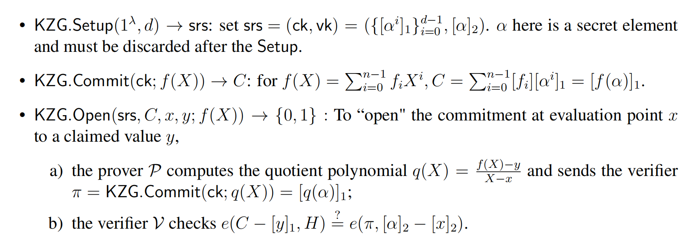

# 完成setup中的commit和verification_key函数
[CODE](/plonkathon/setup.py)
## commit
回顾下KZG commitment的三个步骤：

commit本质上是将用户输入的多项式系数，即`test.py`中的:
```
    dummy_values = Polynomial(
        list(map(Scalar, [1, 2, 3, 4, 5, 6, 7, 8])), Basis.LAGRANGE
    )
```
commit到setup中从from_file中选取的-组秘密参数`powers_of_x`，即计算:
$$
\sum_i [powersOfX_i] * [monimialCoeffs_i] 
$$

但是上述系数是拉格朗日插值系数，需要将其转化为FFT逆变换得到的频率系数。***为什么要这么做，未理解***。需要注意的是要保证commit多项式的阶数不能大于powers_of_x的阶数。然后就是计算上述公式，这里可以仔细分析下`ec_lincomb`这个函数，如果直接迭代求解则加法和程序的运算次数是O(n),这里则通过[递归计算](https://en.wikipedia.org/wiki/Elliptic_curve_point_multiplication)将乘法和加法的次数从直接降到了O(log n)

```
# Elliptic curve point multiplication
def multiply(pt: Point2D[Field], n: int) -> Point2D[Field]:
    if n == 0:
        return None 
    elif n == 1:   # computation complete
        return pt
    elif not n % 2:
        return multiply(double(pt), n // 2)  # doubling when d is even 
    else:
        return add(multiply(double(pt), int(n // 2)), pt) # addition when d is odd
```

## verification_key
这个则相对比较简单，主要是将群的阶数、Plonk所需的门约束和线约束的系数，以及pairing的生成元(X2)、commit多项式的取值点(root_of_unity)等确定下来。
**但是为什么要这样做，未理解**